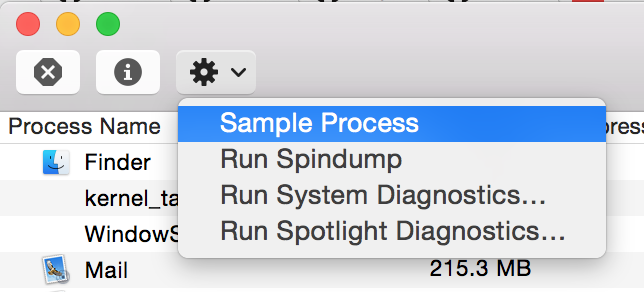
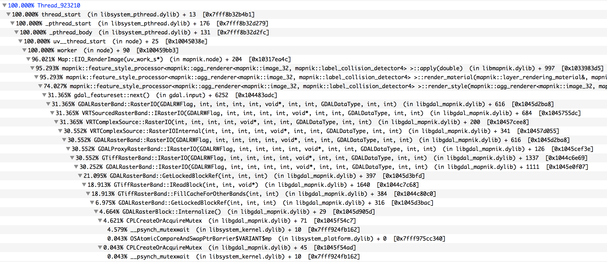

## perf guide

Profiling tools are critical for trying to understand performance bottlenecks in code.

Without real data about what a program is doing while running, detecting bottlenecks is at best a process of trial and error for both users and developers. While thoughtful testing of various program configurations along with measuring time elapsed for decrete runs can often be enough - why not learn faster and funner ways to rapidly collect real data about what a program is doing?

Actual data about program execution like which functions are being called while a program is active helps point to hot parts of the code where most time may be being spent. While users of applications may not easily understand the output of profiling tools, being equipped to generate profiling output can be extremely useful for sharing with developers, since the time to set up robust test cases for developers is can be greater than the time it takes to understand and optimize slow code paths. Therefore it can be invaluable to get a rough snapshot of profiling output from users.

This guide serves to instruct you, the user, to generate some useful profiling output for the program you are running, to share with developers.

Many profiling tools exist on linux - others I've used with success include gprof and oprofile.

But the two most valuable in my opinion are gdb and perf.

## Perf

`perf` is an amazing but relatively unknown profiling tool built into the linux kernal. It is easy to install and run and can be used either for quick analysis of what the whole system is doing (`perf top`) or advanced analysis and comparisions of multiple program benchmarking runs (`perf record`).

It does not require recompiling your c-land programs, so it can be easily used in production systems to debug slow running code or to understand where bottlenecks are. If your program is compiled in debug mode `perf` is able to provide more detailed call graphs and annotation of code hot spots.

### Installing Perf

Install `linux-tools-common` first:

    sudo apt-get update
    sudo apt-get install linux-tools-common
    sudo apt-get install linux-base
    uname_r=$(uname -r)
    sudo apt-get install linux-tools-${uname_r%-virtual}

You should now have the `perf` command. Run it as root like:

    sudo perf --help

### Perf top

Running `perf top` will provide a real-time aggregate of functions where most of the time is spent across all cpu's and processes.

    sudo perf top


### Perf record

To isolate profiling to a single process or program use `perf record`. You can launch a process under `perf record` or attach to an already running process

Run a program with `perf record` and profile until the program exits:

    sudo perf record ./test-program

Attach to a running program:

    sudo perf record --pid `pidof program-name` # ctrl-c to stop recording

Handy options to perf record are:
 - `-a`: force `perf record` to track all cpus
 - `-g`: generates call graph information

NOTE: more recent `perf` versions may require an argument tobe passed after the `-g` like `dwarf`

### Perf report

To view the profiling results you use `perf report`.

To bring up an interactive console interface with details do:

    sudo perf report

To dump out all the details of the report to a shareable text file do:

    sudo perf report > profiling-results.txt

### Perf additional docs

- Detailed wiki with tutorial: <https://perf.wiki.kernel.org/index.php/Main_Page>
- Performance analysis tools based on Linux perf_events (aka perf) and ftrace: <https://github.com/brendangregg/perf-tools>
- The developers notes: <http://lxr.free-electrons.com/source/tools/perf/Documentation/examples.txt>
- Compared to oprofile/gprof: <http://rhaas.blogspot.com/2012/06/perf-good-bad-ugly.html>

### Advanced uses of Perf

 - Undertanding memory access: http://mechanical-sympathy.blogspot.co.uk/2012/08/memory-access-patterns-are-important.html

## GDB

GDB, or the GNU debugger, can be used to temporarily stop a program and print what it is doing (a backtrace) and it can do this for all the potential threads the program is using (which can be critical).

Install gdb like:

```
sudo apt-get install gdb
```

Next you need the PID, or process ID of the program you are interested in. Make sure it is running and then find the ID using methods like:

```
# if the application is python based, for example, do:
ps aux | grep python

# or more direct:
pidof python
```
Now, run as root and attach to the process using gdb. Be aware that your program will become hung by attaching, but when we exit gdb it will wake up.

```
sudo gdb --pid `pidof python`
```

The above command should send you into the gdb interpreter and you'll see a line starting with `(gdb)`.

Now, type this command to generate a backtrace of what all threads are doing in the program:

```
thread apply all backtrace
```

Now open a plain text document, create a header called "*** BACKTRACE 1 ***", and paste all the lines gdb output into the doc.

Next, leave gdb and allow your program to continue running again. To do this type:

```
quit
```

Then gdb should prompt you to confirm and will detach (leaving the program running as it was before you attached). The output should look something like:

```
(gdb) quit
The program is running.  Quit anyway (and detach it)? (y or n) y
Detaching from process 55606.
```

Now, for a program that is running very very slowly a single backtrace can often help pinpoint (when a developer sees it) exactly what is going wrong - e.g. some function in the code is being called that indicates the program was misconfigured and explains why the app is not working well.

But, for programs that are running fast (using lots of CPU) a single GDB backtrace will not be trustable in isolation. So, next you should repeat the above steps to generate several more GDB traces.

You can run this quickly in succession like:

```sh
gdb -ex "set pagination 0" -ex "thread apply all bt" --batch --pid `pidof python`
```

Or in a loop like:
```sh
PID=`pidof python`
RUNS=10
SLEEP=1
for x in $(seq 1 ${RUNS})
  do
    echo "*** BACKTRACE $x ***";
    sudo gdb -ex "set pagination 0" -ex "thread apply all bt" --batch --pid $PID;
    sleep ${SLEEP};
  done
```

For more info on this approach see: http://poormansprofiler.org/

## Instruments on OS X

Instruments.app is a visual tool for viewing and interacting with the results of profiling and many other "instruments" you run. The command line tool [iprofiler](https://developer.apple.com/library/ios/documentation/DeveloperTools/Conceptual/InstrumentsUserGuide/GatheringDatafortheFirstTime/GatheringDatafortheFirstTime.html#//apple_ref/doc/uid/TP40004652-CH5-SW1) can be used to generate the data for instruments on the command line. Then the output can be opened and viewed in the Instruments.app graphical interface. The syntax for a profiling trace with `iprofiler` is:

    iprofiler -timeprofiler <your program> <your program args>

If `your program` is local, this works:

    iprofiler -timeprofiler ./your-program <your program args>

If you are running something on your `PATH` like `node` then you need to give iprofiler the absolute path to the binary. You can do this like:

    iprofiler -timeprofiler `which node` <your program args>

When done `iprofiler` will dump a `.dtps` file in the current directory named after your program. You can then launch this like:

    open *.dtps

One drawback of `iprofiler` is that each run overwrites the `.dtps` data file instead of appending. So, to be able to make multiple runs and compare the call stacks you need to set up your profiling script and run it inside of Instruments app (instead of using `iprofiler`). You can do this by clicking `Choose target...`.

Note: You [can also launch instruments from the command line](http://stackoverflow.com/questions/15410465/start-instruments-from-the-command-line) but I've found `iprofiler` to be more convenient.

## Activity Monitor.app on OS X

On OS X when a program starts running slowly, or appears hung, you can figure out what is happening by sampling the process to see what it is doing. Sampling generates a call tree of what C or C++ functions are being called and how much time is spent in each. This call tree may be indecipherable to users unfamiliar with a programs internals. But it can be shared with a developer to quickly diagnose the problem and potential ways to fix it.

To run an Activity Monitor trace on OS X 10.10 do:

1. Open `/Applications/Utilities/Activity Monitor.app`. You can do this on the command line like: `open -a "Activity Monitor"`

2. The main window will display all running processes. Find the process name or id of the process you are interested in and click the gear icon and then `Sample Process`.



3. The sampling will run for several seconds and then output call graphs of each thread.

You can choose `Percent of Thread` for the display to get an easy to screenshot view like:



But to share the entire output with a developer choose `Sample Text` and then you can copy/paste the entire call tree.


